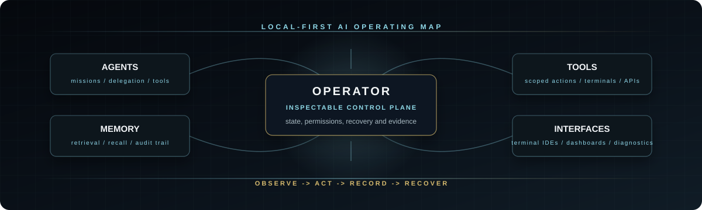
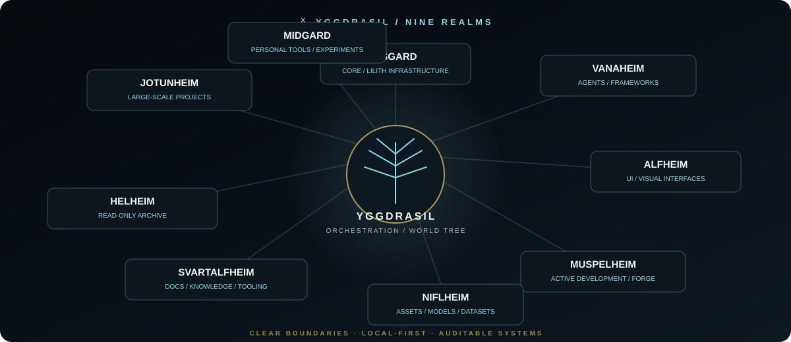
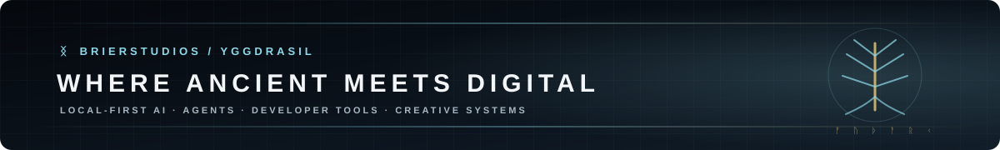

<div align="center">


<br>

[](https://brierstudios.com)
[](https://github.com/BrierAinz?tab=repositories)
[](https://github.com/pulls?q=is%3Apr+author%3ABrierAinz)
[](https://github.com/BrierAinz)
[](https://github.com/BrierAinz/lilith-cli/releases/tag/v4.6.0)
[](https://github.com/BrierAinz/lilith-cli/actions)

<h3>Local-first AI systems, terminal tooling, durable memory and creative infrastructure.</h3>

I build agentic software that stays inspectable by its operator: clear state, explicit permissions, practical recovery paths, and tooling that can be understood after the magic wears off.

</div>

---

<table>
<tr>
<td width="50%" valign="top">

### Current Signal

- Shipping **Lilith CLI** as a terminal-first AI workspace.
- Hardening native **Windows** paths for open-source agent tooling.
- Designing durable memory, retrieval, delegation and rollback boundaries.
- Connecting local AI systems with creative pipelines and studio infrastructure.

</td>
<td width="50%" valign="top">

### Operator Contract

```text
state         visible before clever
permissions   scoped before powerful
memory        recoverable before automatic
agents        useful before autonomous
interfaces    fast before ornamental
```

</td>
</tr>
</table>



## Workbench

| System | Role | What it is for |
|---|---:|---|
| [Lilith CLI](https://github.com/BrierAinz/lilith-cli) | creator / maintainer | Terminal-first AI workspace with durable missions, capability-scoped tooling, memory, orchestration and a Textual IDE. |
| [Hermes Agent](https://github.com/BrierAinz/hermes-agent) | fork / upstream contributor | Working fork of [NousResearch/hermes-agent](https://github.com/NousResearch/hermes-agent), focused on native Windows reliability and upstream fixes. |
| [BrierStudios.com](https://brierstudios.com) | designer / engineer | Public front door for dark-fantasy AI, software and creative-technology work. |
| [Upstream PRs](https://github.com/pulls?q=is%3Apr+author%3ABrierAinz) | contributor | Compatibility, testing and reliability patches across agent, memory and developer tooling projects. |

See [Upstream Work](./docs/UPSTREAM.md) for the contribution themes I tend to focus on.

## Yggdrasil



**Yggdrasil** is the architecture I use to keep AI, tooling, interfaces, memory, creative systems and archives in explicit domains instead of letting everything collapse into one shapeless monolith. The operational core stays private by design; public-facing pieces are published when they are useful outside the local ecosystem.

**BrierStudios** is the studio identity behind the work. Its public home is [brierstudios.com](https://brierstudios.com), while GitHub ownership is centralized here under `BrierAinz`.

## Build Surface

<table>
<tr>
<td valign="top" width="33%">

### Agents

- local-first orchestration
- mission state and recovery
- tool permissions
- memory and retrieval

</td>
<td valign="top" width="33%">

### Interfaces

- terminal IDEs
- Textual TUIs
- React dashboards
- operator-facing diagnostics

</td>
<td valign="top" width="33%">

### Infrastructure

- Python services
- FastAPI and SQLite
- Docker and GitHub Actions
- creative media automation

</td>
</tr>
</table>

## Stack

<p>


</p>

## Principles

> Local-first by default. Clear boundaries over accidental complexity. Evidence before confidence. Recoverability before cleverness. Tools should amplify their operator without becoming opaque.

<div align="center">



<sub>Roots before branches. Systems before spectacle.</sub>

</div>
