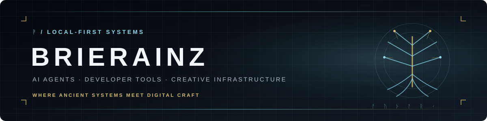

<div align="center">



<br>

[](https://brierstudios.com)
[](https://github.com/BrierAinz?tab=repositories)
[](https://github.com/pulls?q=is%3Apr+author%3ABrierAinz)
[](https://github.com/BrierAinz)

**Local-first AI engineer building agents, terminal tooling, and creative infrastructure.**

</div>

---

## ᛉ About

I design software that stays close to its operator: inspectable, composable, and able to run on hardware you control. My work sits between AI agent architecture, developer experience, automation, and generative tooling.

```text
systems        local-first agents · orchestration · memory · RAG
interfaces     terminal IDEs · Textual TUIs · React dashboards
infrastructure Python · FastAPI · SQLite · Docker · GitHub Actions
creative       ComfyUI pipelines · Blender tooling · media automation
```

## ᚱ Selected work

| Project | Role | Description |
|---|---|---|
| [**Lilith CLI**](https://github.com/BrierAinz/lilith-cli) | Creator · maintainer | A Norse-themed terminal IDE and AI agent interface with a Textual workspace, orchestration, skills, and vector memory. |
| [**Hermes Agent**](https://github.com/BrierAinz/hermes-agent) | Fork · upstream contributor | A working fork of [NousResearch/hermes-agent](https://github.com/NousResearch/hermes-agent), used for native Windows fixes and upstream engineering. |
| [**BrierStudios.com**](https://brierstudios.com) | Designer · engineer | The public front door for my dark-fantasy AI and creative-technology work. |

[View my upstream pull requests →](https://github.com/pulls?q=is%3Apr+author%3ABrierAinz)

## ᛏ Current focus

- Building a terminal-first coding environment around Lilith.
- Improving native Windows reliability for open-source agent tooling.
- Designing durable memory, retrieval, and delegation systems.
- Connecting AI workflows with practical creative infrastructure.

## ᚠ Working stack

<p>


</p>

## ᛇ Engineering principles

> Local-first by default. Clear boundaries over accidental complexity. Evidence before confidence. Tools should amplify their operator without becoming opaque.

---

<div align="center">

<sub>ᚠ ᚢ ᚦ ᚨ ᚱ ᚲ · Roots before branches. Systems before spectacle.</sub>

</div>
